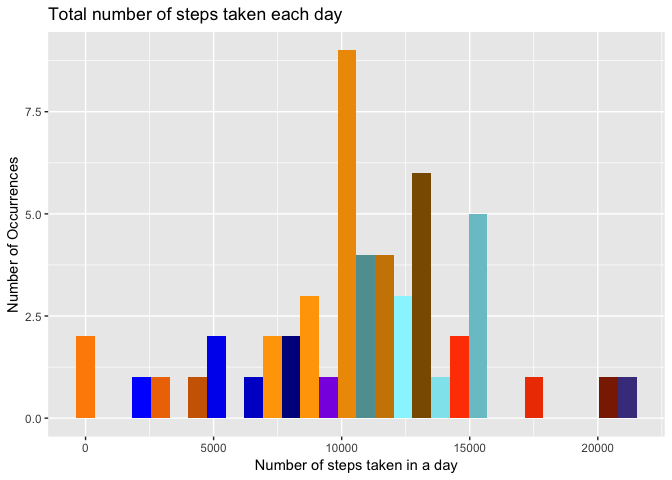
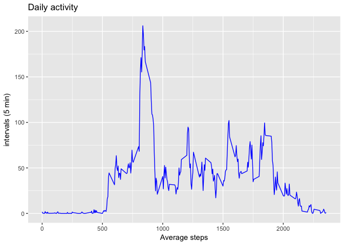
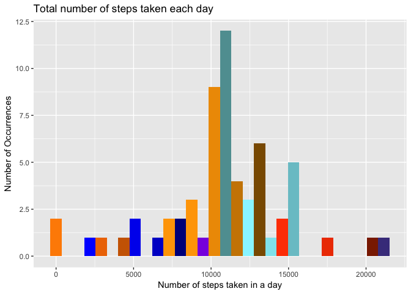
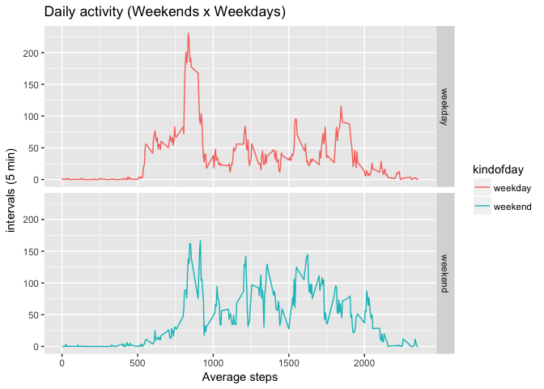

# Reproducible Research: Peeer Assessment 1
Vitor Zamprogno amancio Pereira  
11/5/2017  

This R Markdown document is the results of Reproducible Research Peer-graded Assignment: Course Project 1
submitted by Vitor Zamprogno Amancio Pereiras


This assignment makes use of data from a personal activity monitoring device. This device collects data at 5 minute intervals through out the day. The data consists of two months of data from an anonymous individual collected during the months of October and November, 2012 and include the number of steps taken in 5 minute intervals each day.

The data for this assignment can be downloaded from https://d396qusza40orc.cloudfront.net/repdata%2Fdata%2Factivity.zip


The variables included in this dataset are:

-**steps**: Number of steps taking in a 5-minute interval (missing values are coded as 𠙽𠙰)
-**date**: The date on which the measurement was taken in YYYY-MM-DD format
-**interval**: Identifier for the 5-minute interval in which measurement was taken

The dataset is stored in a comma-separated-value (CSV) file and there are a total of 17,568 observations in this dataset.

### Initial settings

```r
rm(list=ls()) 
setwd("~/Documents/DataAnalyst/CouseraCourse/Reproducible-research/RepData_PeerAssessment1")
require(ggplot2)
```

```
## Loading required package: ggplot2
```

```r
require(dplyr)
```

```
## Loading required package: dplyr
```

```
## 
## Attaching package: 'dplyr'
```

```
## The following objects are masked from 'package:stats':
## 
##     filter, lag
```

```
## The following objects are masked from 'package:base':
## 
##     intersect, setdiff, setequal, union
```

```r
require(lubridate)
```

```
## Loading required package: lubridate
```

```
## 
## Attaching package: 'lubridate'
```

```
## The following object is masked from 'package:base':
## 
##     date
```

## Loading and preprocessing the data


```r
if (!file.exists("activity.zip")) {
  download.file("https://d396qusza40orc.cloudfront.net/repdata%2Fdata%2Factivity.zip","activity.zip", method="curl")
}
if (!file.exists("activity.csv")) {
  unzip("activity.zip")
}
activityFull=read.csv("activity.csv")
paste("Dataset with ",nrow(activityFull)," rows")  
```

```
## [1] "Dataset with  17568  rows"
```

```r
head(activityFull)
```

```
##   steps       date interval
## 1    NA 2012-10-01        0
## 2    NA 2012-10-01        5
## 3    NA 2012-10-01       10
## 4    NA 2012-10-01       15
## 5    NA 2012-10-01       20
## 6    NA 2012-10-01       25
```
We can see that the dataset contains lines with NA, we will then initially remove them

```r
activity = na.omit(activityFull)
head(activity)
```

```
##     steps       date interval
## 289     0 2012-10-02        0
## 290     0 2012-10-02        5
## 291     0 2012-10-02       10
## 292     0 2012-10-02       15
## 293     0 2012-10-02       20
## 294     0 2012-10-02       25
```
## What is mean total number of steps taken per day?

#####Calculating total steps by date

```r
sumStepsActivity = activity %>% group_by(date) %>% summarise(totalSteps = sum(steps))
head(sumStepsActivity)
```

```
## # A tibble: 6 x 2
##         date totalSteps
##       <fctr>      <int>
## 1 2012-10-02        126
## 2 2012-10-03      11352
## 3 2012-10-04      12116
## 4 2012-10-05      13294
## 5 2012-10-06      15420
## 6 2012-10-07      11015
```

#####Let's do the Histogram of the total number of steps taken each day

```r
colores=c(rbind(colors()[grepl("orange",colors())][1:15],colors()[grepl("blue",colors())][1:15]))
g=ggplot(sumStepsActivity,aes(totalSteps)) + geom_histogram(fill=colores) 
g = g + labs(x="Number of steps taken in a day", y="Number of Occurrences", 
             title="Total number of steps taken each day" )
g = g + theme_get() 
print(g)
```

```
## `stat_bin()` using `bins = 30`. Pick better value with `binwidth`.
```

<!-- -->

#####Mean and median number of steps taken each day

```r
paste("Mean of steps taken each day",mean(sumStepsActivity$totalSteps), sep="=")
```

```
## [1] "Mean of steps taken each day=10766.1886792453"
```

```r
paste("Median number of steps taken each day",median(sumStepsActivity$totalSteps), sep="=")
```

```
## [1] "Median number of steps taken each day=10765"
```


## What is the average daily activity pattern?

#####Calculating mean steps by interval

```r
IntervalActivity = activity %>% group_by(interval) %>% summarise(meanSteps = mean(steps))
head(IntervalActivity)
```

```
## # A tibble: 6 x 2
##   interval meanSteps
##      <int>     <dbl>
## 1        0 1.7169811
## 2        5 0.3396226
## 3       10 0.1320755
## 4       15 0.1509434
## 5       20 0.0754717
## 6       25 2.0943396
```

####Ploting

```r
g=ggplot(IntervalActivity,aes(interval,meanSteps)) + geom_line(colour="blue") 
g = g + labs(x="Average steps", y="intervals (5 min)", 
             title="Daily activity" )
g = g + theme_get() 
print(g)
```

<!-- -->

####The 5-minute interval that, on average, contains the maximum number of steps

```r
paste("The 5-minute interval that contains maximum average of steps",
      IntervalActivity$interval[IntervalActivity$meanSteps==max(IntervalActivity$meanSteps)],
      sep="=")
```

```
## [1] "The 5-minute interval that contains maximum average of steps=835"
```

```r
paste("Average of steps at this interval",max(IntervalActivity$meanSteps),sep="=") 
```

```
## [1] "Average of steps at this interval=206.169811320755"
```

## Imputing missing values

Initially (in previous steps) we simply removed the lines containing NA 
**"activity = na.omit (activityFull)"**

Now we will use a strategy to impute values by replacing NAs

####Analyzing the occurrence of NA in the dataset

######Which fields contains NA values?

```r
for(i in 1:ncol(activityFull)) {
#  label=paste("NA values in column ",names(activityFull)[i])
  print(paste(paste("NA values in column ",names(activityFull)[i]),sum(is.na(activityFull[,i]))))
}
```

```
## [1] "NA values in column  steps 2304"
## [1] "NA values in column  date 0"
## [1] "NA values in column  interval 0"
```
**Only the column "steps" contains NA Values**


######How many and what percentage?

```r
paste("Total lines with NA",nrow(activityFull)-nrow(na.omit(activityFull)),sep="=")  
```

```
## [1] "Total lines with NA=2304"
```

```r
print(paste("Percentage of NA values",round(((nrow(activityFull)-nrow(na.omit(activityFull)))/nrow(activityFull))*100),"%"))
```

```
## [1] "Percentage of NA values 13 %"
```

####The strategy adopted was to fill the NA with the average steps of the interval to which the record belongs.
####Will be created a new dataset with the NA filled in this way

```r
activityImp = merge(activityFull,IntervalActivity, by="interval") 
activityImp$steps[is.na(activityImp$steps)] = activityImp$meanSteps[is.na(activityImp$steps)]
head(activityImp)
```

```
##   interval    steps       date meanSteps
## 1        0 1.716981 2012-10-01  1.716981
## 2        0 0.000000 2012-11-23  1.716981
## 3        0 0.000000 2012-10-28  1.716981
## 4        0 0.000000 2012-11-06  1.716981
## 5        0 0.000000 2012-11-24  1.716981
## 6        0 0.000000 2012-11-15  1.716981
```

```r
activityImp =  activityImp[,1:3]
head(activityImp)
```

```
##   interval    steps       date
## 1        0 1.716981 2012-10-01
## 2        0 0.000000 2012-11-23
## 3        0 0.000000 2012-10-28
## 4        0 0.000000 2012-11-06
## 5        0 0.000000 2012-11-24
## 6        0 0.000000 2012-11-15
```


####Histogram of the total number of steps taken each day after missing values are imputed

```r
sumStepsActivityImp = activityImp  %>% group_by(date) %>% summarise(totalSteps = sum(steps))
head(sumStepsActivityImp)
```

```
## # A tibble: 6 x 2
##         date totalSteps
##       <fctr>      <dbl>
## 1 2012-10-01   10766.19
## 2 2012-10-02     126.00
## 3 2012-10-03   11352.00
## 4 2012-10-04   12116.00
## 5 2012-10-05   13294.00
## 6 2012-10-06   15420.00
```

```r
colores=c(rbind(colors()[grepl("orange",colors())][1:15],colors()[grepl("blue",colors())][1:15]))
g=ggplot(sumStepsActivityImp,aes(totalSteps)) + geom_histogram(fill=colores) 
g = g + labs(x="Number of steps taken in a day", y="Number of Occurrences", 
             title="Total number of steps taken each day")
g = g + theme_get() 

print(g)
```

```
## `stat_bin()` using `bins = 30`. Pick better value with `binwidth`.
```

<!-- -->

## Are there differences in activity patterns between weekdays and weekends?

####Creating a dataset containing the information whether the date is weekend or not ("weekend" or "weekday")

```r
activityKD = activityImp %>% 
             mutate(kindofday=ifelse(wday(as.Date(date, format = "%Y-%m-%d"))==1 | 
                                     wday(as.Date(date, format = "%Y-%m-%d"))== 7,"weekend","weekday"))
```

```
## Warning in strptime(x, format, tz = "GMT"): unknown timezone 'zone/tz/
## 2017c.1.0/zoneinfo/America/Sao_Paulo'
```

```r
head(activityKD)
```

```
##   interval    steps       date kindofday
## 1        0 1.716981 2012-10-01   weekday
## 2        0 0.000000 2012-11-23   weekday
## 3        0 0.000000 2012-10-28   weekend
## 4        0 0.000000 2012-11-06   weekday
## 5        0 0.000000 2012-11-24   weekend
## 6        0 0.000000 2012-11-15   weekday
```

####Summarizing

```r
IntervalActivityKD = activityKD  %>% group_by(interval,kindofday) %>% summarise(meanSteps = mean(steps))
head(IntervalActivityKD)
```

```
## # A tibble: 6 x 3
## # Groups:   interval [3]
##   interval kindofday  meanSteps
##      <int>     <chr>      <dbl>
## 1        0   weekday 2.25115304
## 2        0   weekend 0.21462264
## 3        5   weekday 0.44528302
## 4        5   weekend 0.04245283
## 5       10   weekday 0.17316562
## 6       10   weekend 0.01650943
```

####PLoting

```r
g=ggplot(IntervalActivityKD,aes(interval,meanSteps)) + geom_line(aes(colour=kindofday))
g = g + labs(x="Average steps", y="intervals (5 min)", 
             title="Daily activity (Weekends x Weekdays)" )
g = g + theme_get() + facet_grid(kindofday ~ .)
print(g)
```

<!-- -->
